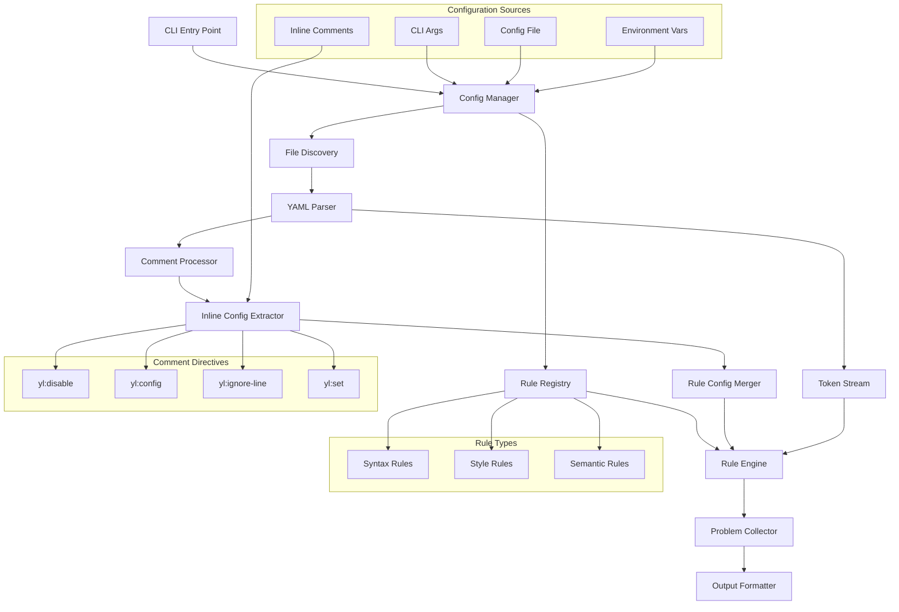

# YL: Rust YAML Linter - Design Document

## Overview

YL is a next-generation YAML linter written in Rust, designed to address the limitations of existing tools like yamllint. The primary innovation is a flexible, comment-based configuration system that allows fine-grained control over linting rules without requiring separate configuration files.

## Motivation

Current YAML linters have several limitations:

1. **Limited inline configuration**: Tools like yamllint only support basic disable/enable comments
2. **Formatter conflicts**: Formatters like yamlfmt don't respect linter directives, leading to conflicts
3. **Inflexible rule parameters**: No way to temporarily adjust rule parameters inline
4. **Poor integration**: Different tools don't share configuration standards

### Example Pain Point

```yaml
# Current yamllint approach - limited options
patch-ingress-gateway.yaml:
  external-dns.alpha.kubernetes.io/hostname: "\  # yamllint disable-line
    airflow.tataridev.com.,\
    argocd-cli.prod.tatari.dev.,\
    api.tatari.tv.,\
    auth.tatari.tv.,"
```

The above requires disabling the entire line-length rule, when we really just want to allow longer lines for this specific multi-line string that shouldn't be reformatted.

## Architecture Overview



## Core Components

### 1. Configuration Manager

The configuration system supports multiple sources with clear precedence:

1. **CLI Arguments** (highest priority)
2. **Inline Comments**
3. **Configuration Files**
4. **Environment Variables**
5. **Built-in Defaults** (lowest priority)

```rust
pub struct ConfigManager {
    cli_config: CliConfig,
    file_config: FileConfig,
    inline_configs: HashMap<LineNumber, InlineConfig>,
    env_config: EnvConfig,
    defaults: DefaultConfig,
}

impl ConfigManager {
    fn resolve_rule_config(&self, rule_id: &str, line: LineNumber) -> RuleConfig {
        // Merge configs with proper precedence
    }
}
```

### 2. Rule System

Rules are modular and composable:

```rust
pub trait Rule {
    fn id(&self) -> &'static str;
    fn check(&self, context: &LintContext, config: &RuleConfig) -> Vec<Problem>;
    fn default_config(&self) -> RuleConfig;
    fn validate_config(&self, config: &RuleConfig) -> Result<(), ConfigError>;
}

pub enum RuleType {
    Syntax,    // YAML parsing errors
    Style,     // Formatting, spacing, etc.
    Semantic,  // Logic, duplicates, etc.
}
```

### 3. Comment Directive System

The key innovation - rich inline configuration through comments:

```rust
pub struct CommentProcessor {
    directive_patterns: Vec<DirectivePattern>,
}

pub enum Directive {
    Disable { rules: Vec<String>, scope: Scope },
    Config { rule: String, params: HashMap<String, Value> },
    Set { rule: String, params: HashMap<String, Value> },
    IgnoreLine { rules: Vec<String> },
    IgnoreSection { rules: Vec<String> },
    IgnoreFile,
}

pub enum Scope {
    Line,           // Current line only
    Block,          // Until next directive or block end
    Section,        // Until end of current YAML section
    File,           // Rest of file
}
```

## Comment Directive Syntax

### Basic Syntax

```yaml
# yl:directive [scope] rule[.param]=value [rule2[.param2]=value2] [options]
```

### Examples

#### Rule Control
```yaml
# yl:disable line-length                    # Disable rule for rest of block
# yl:disable-line line-length,truthy        # Disable rules for this line only
# yl:ignore-file                            # Ignore entire file
# yl:ignore-section line-length             # Ignore rule for current YAML section
```

#### Parameter Configuration
```yaml
# yl:set line-length.max=120                # Set parameter for rest of block
# yl:config indentation.spaces=4            # Configure rule for rest of block

# Multiple parameters
# yl:config line-length.max=100,allow-non-breakable-words=false indentation.spaces=2
```

#### Scoped Configuration
```yaml
# Block scope (default) - until next directive or end of current block
# yl:disable line-length
long_key: "this very long line won't trigger line-length rule"
another_key: "neither will this one"

# Line scope - current line only
long_line: "this is too long" # yl:disable-line line-length

# Section scope - current YAML mapping/sequence
spec:
  # yl:disable-section line-length
  containers:
    - name: "very-long-container-name-that-would-normally-exceed-line-length"
    - image: "registry.example.com/very/long/image/name/that/exceeds/normal/limits"
# line-length rule re-enabled here
```

### Advanced Directives

```yaml
# Conditional directives based on context
# yl:if-path "spec.containers.*" set line-length.max=120
# yl:if-key "external-dns.alpha.kubernetes.io/*" disable line-length

# Inheritance control
# yl:inherit-config parent  # Use parent section's config
# yl:reset-config           # Reset to file-level config
```

## Configuration File Format

### Basic Configuration

```yaml
# yl.yaml
extends: default

rules:
  line-length:
    max: 80
    level: error
    allow-non-breakable-words: true

  indentation:
    spaces: 2
    indent-sequences: true
    level: error

  truthy:
    allowed-values: ['true', 'false', 'yes', 'no']
    level: warning

ignore:
  - "*.generated.yaml"
  - "vendor/**"
  - "!vendor/important.yaml"

yaml-files:
  - "*.yaml"
  - "*.yml"
  - ".yamllint"
```

### Rule Configuration Schema

```rust
pub struct RuleConfig {
    pub enabled: bool,
    pub level: Level, // error, warning, info
    pub params: HashMap<String, ConfigValue>,
    pub ignore_patterns: Vec<String>,
}

pub enum ConfigValue {
    Bool(bool),
    Int(i64),
    String(String),
    Array(Vec<ConfigValue>),
    Enum(String, Vec<String>), // value, allowed_values
}

pub enum Level {
    Error,   // Exit with error code
    Warning, // Print warning but continue
    Info,    // Informational only
}
```

## Built-in Rules

### Syntax Rules
- **yaml-syntax**: Basic YAML parsing errors
- **document-structure**: Document start/end markers
- **key-duplicates**: Duplicate keys in mappings

### Style Rules
- **line-length**: Line length limits with smart handling
- **indentation**: Consistent indentation with configurable spaces
- **trailing-spaces**: Trailing whitespace detection
- **empty-lines**: Empty line management
- **brackets**: Bracket spacing and style
- **braces**: Brace spacing and style
- **colons**: Colon spacing rules
- **commas**: Comma spacing rules
- **hyphens**: Hyphen spacing in sequences

### Semantic Rules
- **truthy**: Boolean value consistency
- **quoted-strings**: String quoting consistency
- **key-ordering**: Alphabetical key ordering
- **anchors**: Anchor and alias validation
- **float-values**: Float format validation
- **octal-values**: Octal number detection

## Context-Aware Processing

```rust
pub struct LintContext<'a> {
    pub file_path: &'a Path,
    pub content: &'a str,
    pub current_line: usize,
    pub yaml_path: Vec<String>, // e.g., ["spec", "containers", "0", "name"]
    pub parent_context: Option<&'a LintContext<'a>>,
    pub inline_config: Option<&'a InlineConfig>,
}
```

This allows rules to make decisions based on:
- File path patterns
- YAML structure location
- Parent context
- Inline configuration overrides

## Plugin System

```rust
pub trait RulePlugin {
    fn rules(&self) -> Vec<Box<dyn Rule>>;
    fn name(&self) -> &'static str;
    fn version(&self) -> &'static str;
}

pub struct RuleRegistry {
    builtin_rules: HashMap<String, Box<dyn Rule>>,
    plugin_rules: HashMap<String, Box<dyn Rule>>,
}
```

Plugins can be:
- Compiled into the binary
- Loaded as dynamic libraries
- Defined in configuration files (for simple rules)

## Integration with Other Tools

### Formatter Integration

The directive format is designed to be parseable by other tools:

```yaml
# This addresses the original pain point:
patch-ingress-gateway.yaml:
  # yl:disable-section line-length  # Tell formatters: don't reformat this section
  external-dns.alpha.kubernetes.io/hostname: "\
    airflow.tataridev.com.,\
    argocd-cli.prod.tatari.dev.,\
    api.tatari.tv.,\
    auth.tatari.tv.,"
  # yl:enable line-length  # Re-enable for rest of file
```

### Editor Integration

- LSP server support for real-time linting
- Standardized diagnostic format
- Quick-fix suggestions
- Configuration hints

## Performance Considerations

### Rust Advantages
- **Zero-cost abstractions**: No runtime overhead for unused features
- **Memory safety**: No segfaults or memory leaks
- **Concurrency**: Easy parallel processing with Rayon
- **Single binary**: No runtime dependencies

### Optimization Strategies
- **Incremental parsing**: Only re-parse changed sections
- **Rule caching**: Cache rule results for unchanged content
- **Parallel processing**: Process multiple files concurrently
- **Smart file discovery**: Respect .gitignore and custom patterns

## Error Handling and Diagnostics

```rust
pub struct Problem {
    pub line: usize,
    pub column: usize,
    pub level: Level,
    pub rule: String,
    pub message: String,
    pub suggestion: Option<String>,
}

pub struct Diagnostic {
    pub file_path: PathBuf,
    pub problems: Vec<Problem>,
    pub stats: LintStats,
}
```

### Output Formats
- **Human-readable**: Colored, formatted output for terminals
- **JSON**: Machine-readable for CI/CD integration
- **GitHub Actions**: Native GitHub annotations
- **JUnit XML**: For test result integration
- **SARIF**: Static analysis results format

## Security Considerations

- **Safe YAML parsing**: Use memory-safe parsers, avoid code execution
- **Path traversal protection**: Validate file paths and patterns
- **Resource limits**: Prevent DoS through large files or deep nesting
- **Plugin sandboxing**: Isolate plugin execution if dynamic loading is supported

## Backward Compatibility

- **yamllint config**: Support existing yamllint configuration files
- **Migration tool**: Convert yamllint configs to yl format
- **Gradual adoption**: Allow mixed directive styles during transition

## Future Extensions

- **Custom rule DSL**: Define simple rules in configuration
- **Machine learning**: Learn project-specific patterns
- **Auto-fix**: Automatically fix certain classes of problems
- **Diff-aware**: Only lint changed lines in version control
- **Team policies**: Shared rule configurations across teams
